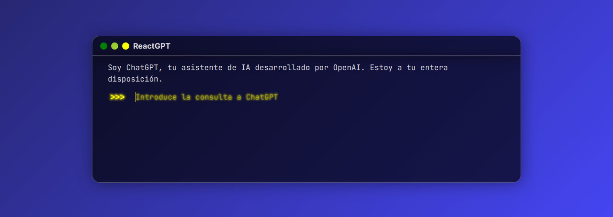

# ReactGPT

Aplicación que simula una terminal con el que lanzar consultas a **ChatGPT**. Está desarrollada mediante [React](https://react.dev) y [Vite](https://vitejs.dev).

Se pueden utilizar estos comandos para interactuar con la terminal.
+ **clear** - Borra la pantalla.
+ **bucle** - Imprime un bucle del 1 al 10.

**¡NOTA!**: Para recibir las respuestas de ChatGPT, tienes que generar una clave API en la [API de OpenAI](https://platform.openai.com/docs/api-reference) y luego copiar esa clave dentro de la variable donde se guarda la **API KEY** dentro del archivo **/src/logic/ChatGPT.jsx**. Por lo visto, OpenAI borra esas claves API que se muestran al público como medida de seguridad.
